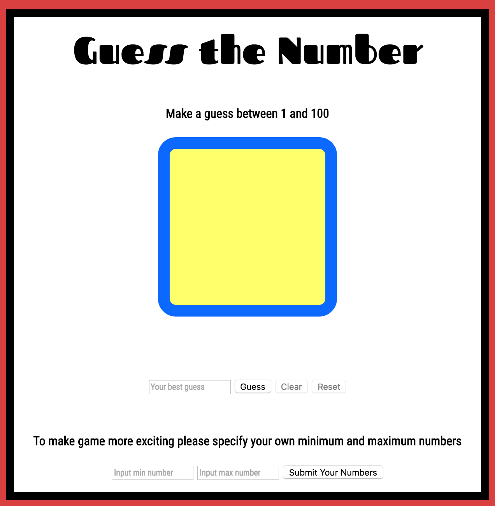

# number-guesser

Module 1, Project #1 - Created by Adam Bernard & Kirsten Swanson

## Game Introduction

This game requires the player to guess a number that the game has randomly chosen. The range is 0-100 by default, but the player can enter their own range if they wish at the bottom of the page. The game will give the player hints if their guess is too low or too high. Once the player guesses correctly, they're notified of their brilliance and the minimum range decreases by 10 and the maximum range increases by 10 to make the game a little more difficult. To play the game again the player needs to click the 'reset' button and a new number will be generated.

## Game Functionality

On page load the game chooses a random number by the 'Math.random' function between the default range of 1-100. When the player submits their number with the 'guess' button it is displayed in the big yellow box. The player's guess goes through a series of comparisons and is evaluated to check if it matches the random generated number. Below the yellow box there is a hint that displays whether the player guessed too low, too high, or correctly based on the comparisons. If the player guesses correctly they receive a 'You are brilliant' message and both the minimum and maximum ranges are increased by 10, which widens the guessing range making it more difficult. Initially the 'clear' and 'reset' buttons are disabled until the player inputs their guess. In the middle of the game if the player decides to input their own range the previous number guessed and the hint will go away. At any time the player can reset the game, so they are guessing between the range of 1-100 or their own range and the reset will also clear the minimum and maximum range increases.
